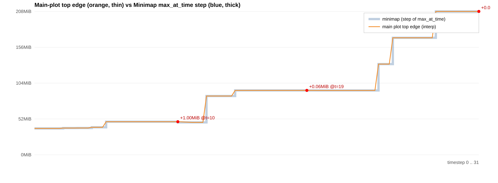

# Is the upper edge of the main stacked plot the same as the minimap?

**Short answer: same curve, NOT identical.** Both encode *total active memory
over time* and coincide at almost every timestep, but they are not pixel-for-
pixel equal — they diverge slightly at allocation/free events.

## Why they are the same quantity

- Main plot (`MemoryPlot`, `MemoryViz.js`): one filled `<polygon>` per
  allocation, stacked by memory offset. The **upper edge** at timestep `t` is
  the sum of everything live = `total_mem + total_summarized_mem`.
- Minimap (`MiniMap`, `MemoryViz.js`): draws `data.max_at_time` as a step-area,
  and `max_at_time[t] = total_mem + total_summarized_mem` too
  (`process_alloc_data.js`, in `advance()`).
- Both y-axes use the same domain `[0, max_size]`, so heights are directly
  comparable (`max_size = max(max_at_time)`).

So by construction they are the same running-total curve.

## Why they are NOT identical — the experiment

`docs/experiments/edge_vs_minimap.mjs` runs the real `process_alloc_data` on
`tests/snapshot.json`, reconstructs the drawn top edge from the polygon
vertices (SVG polygon edges are straight lines between vertices → linear
interpolation, exactly what is painted), and compares it to `max_at_time` at
every timestep.

```
timesteps=32   exact matches=29/32   divergences=3
 t   edge(bytes)  minimap(bytes)  diff
 10   50276256     49227684        +1048572  (+1.00 MiB)
 19   97811368     97751368          +60000  (+0.057 MiB)
 31  217763364    217759364           +4000  (+0.004 MiB)
max |edge - minimap| = 1.000 MiB = 0.482% of the 207.7 MiB peak
```

**Cause:** the main plot places polygon vertices only at **event timesteps**
and connects them with **straight, slanted edges** (allocations/frees ramp over
a few timesteps — note the `timestep + 3` closures in `process_alloc_data.js`).
The minimap is a **pure per-timestep step** of `max_at_time`. In the gaps
between events the slanted edge and the step disagree by up to one block's size.



Orange = main-plot top edge (interpolated between vertices); thick blue =
minimap step of `max_at_time`. They overlap everywhere except the marked
transition points.

## Other (structural) differences, not shape

- Different pixel size: main plot fills the viewport; minimap is fixed
  `width 1024 × height 70`.
- The main plot is **zoomable** (`thezoom` / brush `select_window`); after a
  zoom the two no longer share an x-scale.
- If the number of allocations exceeds `max_entries` (default 15000), more of
  the stack folds into the summarized band — the composition changes, but the
  **top edge total** is unaffected (apart from the interpolation artifact
  above).

## Reproduce

```
node docs/experiments/edge_vs_minimap.mjs          # numeric table
node docs/experiments/edge_vs_minimap.mjs --emit   # also write overlay_data.json
```
