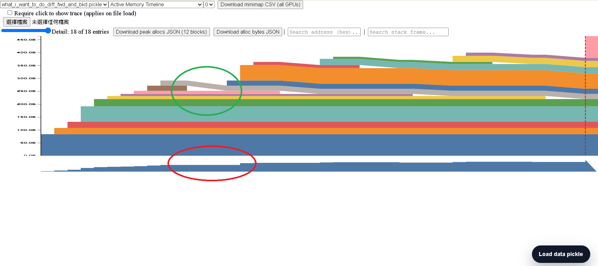

# Why the interior block drops (green) but the minimap does not (red)

Question (`what_i_want_to_do_diff_fwd_and_bkd.pickle`): in the main plot a block
visibly goes **down** (green circle), yet at the same timesteps the **minimap
does not drop** (red circle). Why?



## Short answer

The main plot and the minimap show **different things**, and a *free followed by
an immediate same‑size re‑alloc* looks different in each:

- **Main plot** draws every block individually, stacked. Freeing an **interior**
  block makes every block *above it* slide **down** — a visible downward notch.
- **Minimap** draws only the running **total** (`max_at_time`). A free that is
  immediately compensated by an equal alloc leaves the total unchanged, so it
  stays flat.

## The mechanism, in the code

From the original trace (`device_traces[0]`), the freed address `…8224`:

```
 9 alloc          addr=…8224 size=20   total 272→292
10 alloc          addr=…8736 size=20   total 292        (…8736 sits ON TOP of …8224)
11 free_requested addr=…8224 size=20
12 free_completed addr=…8224 size=20   total 292→272    (the momentary drop)
13 alloc          addr=…8224 size=20   total 272→292    (same addr, same size, immediately)
```

**Green (the notch) — `shift_elements_above`.** When the interior block `…8224`
is freed, `process_alloc_data.js` recompacts the stack:

```js
// process_alloc_data.js  (free branch)
advance(1);                          // (A) sample max_at_time — see below
...remove the block from the stack...
if (idx < current.length) {          // only if it was NOT the top block
  shift_elements_above(idx, -size);  // animate every block above sliding DOWN by `size`
  advance(3);
}
total_mem -= size;                   // (B) total decremented AFTER the samples
```

`shift_elements_above` gives every block above the freed one new vertices with
`offset -= size` over `timestep → timestep+3` — that downward slope **is** the
green notch. In the original, block `…8736` recompacts from offset `272 → 252`.

**Red (stays flat) — sampling order + the compensating re‑alloc.** Two facts:

1. `max_at_time` is sampled by `advance()` at **(A)**, *before* `total_mem -= size`
   at **(B)**. So the free does not lower the sampled total on its own timesteps.
2. The very next event re‑allocates the same 20 bytes (same address), so by the
   next sample the total is already back to 292.

Net effect: `max_at_time` = `…,292,292,292,292,292,292,…` — no dip. (Confirmed by
`original_minimap.csv`: it never records the transient `272`.)

This is the **forward/backward** distinction the file name asks for: at the
fwd→bkd boundary an activation is freed and a similar‑size gradient is allocated,
so the **total** barely moves (minimap flat) while the **per‑block** view shows
the churn (the notch).

## Verification — a controlled 2×2

`gen_cases.py` builds four traces: `{interior, top}` free × `{realloc, no‑realloc}`.
`analyze_cases.mjs` runs the real `process_alloc_data` and reports, per case,
whether the minimap dips (`max_at_time` decreases) and whether a recompaction
notch occurs (some block's `offset` decreases):

| case | RED minimap dips? | GREEN recompaction notch? | max_at_time |
|---|:--:|:--:|---|
| **interior + realloc**  | **no**  | **YES** | `…472,472,472,472,472,472,496` |
| interior + no‑realloc   | **YES** | YES     | `…496,496,496,496,496,480` |
| top + realloc           | no      | **no**  | `…472,472,472,496` |
| top + no‑realloc         | YES     | no      | `…500,500,484` |

This isolates both halves of the hypothesis:

- **GREEN notch ⇔ the freed block is INTERIOR** (top‑of‑stack frees have nothing
  above to recompact, so no notch — regardless of re‑alloc).
- **RED stays flat ⇔ there is a compensating re‑alloc** (remove it and the total
  drops, so the minimap dips too — regardless of position).

The original `what.pickle` is exactly the **interior + realloc** cell → green
drops, red flat.

Screenshots in `shots/`:
- `case_interior_realloc.png` — reproduces it: the interior (red) block frees, the
  bands above slide down (notch), the minimap stays up.
- `case_interior_norealloc.png` — same notch, but the minimap now dips.
- `case_top_realloc.png` / `case_top_norealloc.png` — no notch; minimap flat / dips.

## Reproduce

```bash
python3 gen_cases.py            # writes cases/*.pickle
node analyze_cases.mjs          # prints the 2x2 table above
# or load any cases/*.pickle in the tool (gh-pages) and use
# "Download minimap CSV (all GPUs)" to see max_at_time.
```
